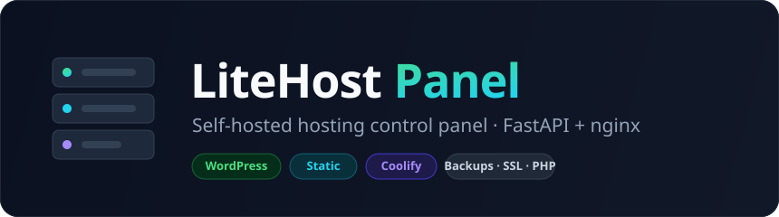
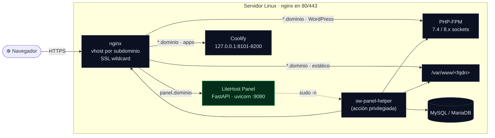

<div align="center">



<h3>Panel de control <em>self-hosted</em> y ligero para administrar muchos sitios en un solo servidor.</h3>

<p>
Aprovisiona sitios <b>WordPress</b>, <b>estáticos</b> y apps de <b>Coolify</b> como subdominios
detrás de <b>nginx</b> con SSL wildcard — y gestiona PHP-FPM, MySQL, backups, archivos y
documentación desde una sola interfaz.
</p>

<p>
<a href="#-quick-start"><strong>Empezar »</strong></a>
&middot;
<a href="#-características">Features</a>
&middot;
<a href="#-arquitectura">Arquitectura</a>
&middot;
<a href="https://github.com/cristiancorreau/litehost-panel/issues/new">Reportar bug</a>
</p>

[](https://github.com/cristiancorreau/litehost-panel/actions/workflows/ci.yml)
[](LICENSE)
[](https://www.python.org/)
[](https://fastapi.tiangolo.com)
[](https://nginx.org)

[](CONTRIBUTING.md)
[](https://github.com/cristiancorreau/litehost-panel/stargazers)

</div>

---

<details>
<summary><b>📖 Tabla de contenidos</b></summary>

- [¿Por qué?](#-por-qué)
- [Características](#-características)
- [Arquitectura](#-arquitectura)
- [Entorno recomendado](#-entorno-recomendado)
- [Quick start](#-quick-start)
- [Configuración](#-configuración)
- [El helper privilegiado](#-el-helper-privilegiado)
- [Seguridad](#-seguridad)
- [Stack](#-stack)
- [Contribuir](#-contribuir)
- [Licencia](#-licencia)

</details>

## 💡 ¿Por qué?

Montar varios WordPress, landings estáticas y apps Docker en un mismo VPS suele terminar en
una maraña de vhosts escritos a mano, certificados, sockets de PHP y dumps de MySQL dispersos.
**LiteHost Panel** pone todo eso detrás de una UI simple: creas un subdominio, eliges el tipo
de sitio y el panel se encarga del docroot, la base de datos, el vhost de nginx, el SSL y el
backup automático al borrar. Sin agentes, sin nube — un solo proceso FastAPI en tu servidor.

> [!NOTE]
> Este proyecto nació como herramienta interna de un servidor de laboratorio y se publica para
> la comunidad. Los valores del entorno original fueron reemplazados por placeholders
> (`example.com`, `appuser`, IPs de documentación) y **todo es configurable por variables de
> entorno**. Adáptalo a tu infraestructura antes de usarlo.

## ✨ Características

| | Característica | Qué hace |
|---|---|---|
| 🟢 | **Sitios WordPress** | Descarga el core, crea BD + usuario MySQL, escribe `wp-config.php`, genera el vhost y corre `wp core install` vía WP-CLI. |
| 🔵 | **Sitios estáticos** | Docroot + vhost listos, con instrucciones de subida (scp / zip). |
| ♻️ | **Restore Duplicator** | Desde un paquete subido o desde disco, con reescritura de URLs (`wp search-replace`). |
| 🟣 | **Apps / servicios Coolify** | Registra un subdominio que hace `proxy_pass` a un puerto del host (rango 8101–8200) gestionado por Coolify. |
| 🌐 | **Gestor de vhosts nginx** | Inventario en vivo de `sites-enabled`, plantillas `php` / `static` / `proxy`, habilitar/eliminar, cambiar PHP por sitio. |
| ⚙️ | **PHP-FPM** | Ver y editar parámetros del pool (`pm`, `memory_limit`, uploads…) por versión. |
| 💾 | **Backups & restore** | `mysqldump` + `tar` del docroot al borrar un sitio, restaurable desde el panel. |
| 📂 | **Gestor de archivos** | Navegar / editar / subir / permisos dentro de `/var/www` (acotado y seguro). |
| 📊 | **Métricas** | CPU, RAM, disco y uso por sitio. |
| 📚 | **Mini-wiki** | Páginas markdown editables (incluye docs de arquitectura y de multitenancy con Supabase). |
| 🪧 | **Landing autogenerada** | Index del dominio base con tarjetas de los sitios activos. |

## 🏗 Arquitectura

El panel corre como un **usuario sin privilegios**. Cada acción que requiere root se delega en
un único helper auditable (`sw-panel-helper`) autorizado por una regla de `sudoers` acotada.



## 🖥 Entorno recomendado

Probado en **Ubuntu Server 22.04 LTS**. Este es el stack de referencia:

| Componente | Recomendado | Notas |
|---|---|---|
| **Sistema operativo** | **Ubuntu Server 22.04 LTS** (Jammy) | También funciona en 24.04 LTS. 64-bit. |
| **Python** | 3.10+ | 22.04 trae 3.10; 24.04 trae 3.12. |
| **nginx** | 1.18+ | Reverse proxy y vhosts. |
| **PHP-FPM** | 7.4 + 8.1–8.4 (vía PPA `ondrej/php`) | Multi-versión seleccionable por sitio. |
| **Base de datos** | MySQL 8.0 *o* MariaDB 10.6+ | El servidor de referencia usa MySQL 8.0. |
| **certbot** | 1.21+ | Certificado **wildcard** por desafío DNS. |
| **RAM** | 2 GB mínimo · 4 GB+ recomendado | Más si usas Coolify/Supabase. |
| **Red / acceso** | root o `sudo`, puertos 80/443 públicos | DNS con wildcard `*.tu-dominio` → servidor. |

> [!TIP]
> El instalador (`install.sh`) puede añadir el PPA `ondrej/php` e instalar todas las
> versiones de PHP por ti. Si lo haces a mano:
> ```bash
> sudo add-apt-repository -y ppa:ondrej/php && sudo apt update
> sudo apt install php7.4-fpm php8.1-fpm php8.2-fpm php8.3-fpm php8.4-fpm
> ```

Un **VPS de 2 vCPU / 4 GB RAM** con Ubuntu 22.04 LTS es un punto de partida cómodo para
alojar varios WordPress + sitios estáticos.

## 🚀 Quick start

> **Requisitos:** Linux con `nginx`, `php-fpm` (7.4 / 8.x), `mysql`/`mariadb`, `certbot`
> (SSL wildcard) y Python 3.10+. Opcional: [Coolify](https://coolify.io/) para apps Docker.
> DNS con un wildcard `*.tu-dominio` apuntando al servidor. Ver
> [Entorno recomendado](#-entorno-recomendado).

### Opción A · Instalador interactivo (recomendado)

Un asistente paso a paso que instala dependencias, crea el venv, te pregunta cada valor,
**genera el hash bcrypt y el secreto**, y deja listos el `.env`, el helper, sudoers, el
servicio systemd y el vhost de nginx:

```bash
git clone https://github.com/cristiancorreau/litehost-panel.git /opt/sw-panel
cd /opt/sw-panel
sudo ./install.sh
```

```text
  LiteHost Panel · instalador
  ---------------------------------------------
  ▸ Paso 4/8 · Configuración del panel
    — Acceso al panel —
    Usuario administrador del panel [admin]:
    Contraseña del administrador:
    — Dominio —
    Dominio base de los subdominios (wildcard *.dominio) [lab.example.com]:
  ✓ Hash bcrypt de la contraseña generado
  ✓ Servicio sw-panel activo (127.0.0.1:9080)
```

¿Solo quieres (re)generar la configuración? `sudo ./install.sh --env-only`

### Opción B · Manual

<details>
<summary>Pasos manuales equivalentes</summary>

```bash
# 1) Usuario de servicio sin privilegios (el que corre el panel)
sudo useradd --system --no-create-home --shell /usr/sbin/nologin swpanel

# 2) Código y entorno virtual
git clone https://github.com/cristiancorreau/litehost-panel.git /opt/sw-panel
cd /opt/sw-panel
python3 -m venv venv && ./venv/bin/pip install -r requirements.txt

# 3) Configuración del panel (genera el hash siguiendo los comentarios del archivo)
sudo mkdir -p /etc/sw-panel /var/lib/sw-panel
sudo cp .env.example /etc/sw-panel/panel.env
sudo nano /etc/sw-panel/panel.env
sudo chown root:swpanel /etc/sw-panel/panel.env && sudo chmod 0640 /etc/sw-panel/panel.env
sudo chown -R swpanel:swpanel /var/lib/sw-panel

# 4) Rutas del helper (sudo limpia el entorno; ver "Configuración")
sudo tee /etc/sw-panel/helper.env >/dev/null <<'EOF'
PANEL_WWW_ROOT=/var/www
PANEL_NGINX_AVAILABLE=/etc/nginx/sites-available
PANEL_NGINX_ENABLED=/etc/nginx/sites-enabled
PANEL_BACKUPS_DIR=/home/appuser/sw-panel-backups
EOF
sudo chmod 0644 /etc/sw-panel/helper.env

# 5) Helper privilegiado + sudoers (el modo 0750 root:root es parte del modelo de seguridad)
sudo install -o root -g root -m 0750 deploy/sw-panel-helper /usr/local/bin/sw-panel-helper
sudo install -o root -g root -m 0440 deploy/sudoers.sw-panel /etc/sudoers.d/sw-panel
sudo visudo -cf /etc/sudoers.d/sw-panel

# 6) Servicio systemd (edita User/Group y ReadWritePaths si no usas swpanel/appuser)
sudo cp deploy/sw-panel.service /etc/systemd/system/
sudo systemctl daemon-reload && sudo systemctl enable --now sw-panel

# 7) Vhost del panel (edita server_name + rutas SSL)
sudo cp deploy/nginx-panel.conf.example /etc/nginx/sites-available/panel.conf
sudo ln -s /etc/nginx/sites-available/panel.conf /etc/nginx/sites-enabled/
sudo nginx -t && sudo systemctl reload nginx
```

Los directorios de backups y uploads (`/home/appuser/sw-panel-backups`, `/home/appuser/uploads`)
deben existir y pertenecer a tu `PANEL_SYSTEM_USER`; systemd los declara en `ReadWritePaths`.

</details>

El panel queda en **`https://panel.<tu-dominio>`**, protegido con HTTP Basic.

## 🔧 Configuración

El panel lee **`/etc/sw-panel/panel.env`** (ver [`.env.example`](.env.example)). La ruta es
configurable con la variable `PANEL_ENV_FILE`, útil en desarrollo.

<details>
<summary><b>Variables de entorno</b></summary>

| Variable | Default | Para qué |
|---|---|---|
| `PANEL_ADMIN_USER` | `admin` | Usuario del login. |
| `PANEL_ADMIN_PASSWORD_HASH` | — | Hash **bcrypt** de la contraseña. Sin él, ningún login es válido. |
| `PANEL_LAB_DOMAIN` | `lab.example.com` | Dominio base de los subdominios. |
| `PANEL_SYSTEM_USER` | `appuser` | Usuario dueño de `/home/<user>` (uploads/backups). |
| `MYSQL_ROOT_USER` / `MYSQL_ROOT_PASS` | `root` / — | Credenciales para crear BDs. |
| `MYSQL_HOST` | `localhost` | Host de MySQL/MariaDB. |
| `PANEL_DEFAULT_PHP` | `8.3` | PHP por defecto para sitios nuevos. |
| `COOLIFY_API_URL` / `COOLIFY_API_TOKEN` | — | Integración opcional con Coolify. Token vacío = sin Coolify. |
| `COOLIFY_PORT_START` / `COOLIFY_PORT_END` | `8101` / `8200` | Rango de puertos para apps. |
| `PANEL_SESSION_SECRET` | `change-me` | **Reservado, hoy sin efecto.** La autenticación es HTTP Basic *stateless*: el panel no crea sesiones. El instalador lo genera igual, previendo un futuro login por cookie. |

Rutas — todas opcionales, con defaults sensatos:

| Variable | Default |
|---|---|
| `PANEL_ENV_FILE` | `/etc/sw-panel/panel.env` |
| `PANEL_BASE_DIR` | `/opt/sw-panel` |
| `PANEL_DATA_DIR` | `/var/lib/sw-panel` (SQLite, uploads, assets de la wiki) |
| `PANEL_HOME_DIR` | `/home/<PANEL_SYSTEM_USER>` |
| `PANEL_BACKUPS_DIR` | `<PANEL_HOME_DIR>/sw-panel-backups` |
| `PANEL_WWW_ROOT` | `/var/www` |
| `PANEL_NGINX_AVAILABLE` / `PANEL_NGINX_ENABLED` | `/etc/nginx/sites-available` / `-enabled` |
| `PANEL_SSL_CERT` / `PANEL_SSL_KEY` | `/etc/letsencrypt/live/<dominio>/{fullchain,privkey}.pem` |
| `PANEL_LANDING_HTML` | `<PANEL_WWW_ROOT>/<dominio>/index.html` |

Genera el hash de la contraseña:

```bash
python3 -c "from passlib.hash import bcrypt; print(bcrypt.hash('TU_PASSWORD'))"
```

</details>

<details>
<summary><b>El segundo archivo: <code>helper.env</code></b></summary>

`sudo` limpia el entorno, así que el helper **no hereda** la configuración del panel: lee sus
rutas de **`/etc/sw-panel/helper.env`** (modo `0644`, sin secretos). El instalador lo escribe por
ti; si instalas a mano y cambiaste alguna ruta, este archivo debe reflejarla:

```bash
PANEL_WWW_ROOT=/var/www
PANEL_NGINX_AVAILABLE=/etc/nginx/sites-available
PANEL_NGINX_ENABLED=/etc/nginx/sites-enabled
PANEL_BACKUPS_DIR=/home/appuser/sw-panel-backups
```

Si falta, el helper usa esos mismos valores por defecto — el desajuste solo aparece si tus rutas
reales son otras.

</details>

### Health check

`GET /healthz` responde `{"ok": true}` **sin autenticación** — es el único endpoint público junto
con el redirect legacy `/architecture` → `/docs/architecture`. Úsalo para monitoreo de uptime.

## 🛡 El helper privilegiado

[`deploy/sw-panel-helper`](deploy/sw-panel-helper) es una **implementación de referencia**: un
script bash con ~40 subcomandos acotados (nginx, docroots, gestor de archivos, backups, php-fpm,
servicios, WP-CLI). El panel jamás ejecuta root directamente — todo pasa por
`sudo -n /usr/local/bin/sw-panel-helper <subcomando>`, centralizado en
[`app/services/runner.py`](app/services/runner.py). Es el componente con privilegios:
**audítalo y ajústalo a tu entorno antes de producción**.

Conviene entender **dónde está el límite real**:

- La regla de `sudoers` autoriza el **binario, no sus argumentos**. No es un allowlist por
  subcomando: el allowlist real es el `case` dentro del propio script (lo desconocido sale con
  `exit 2`).
- Por eso el helper **debe** quedar `root:root` modo `0750`. Si el usuario del panel pudiera
  escribirlo, toda la contención desaparece.
- El **gestor de archivos** sí está confinado a `$WWW_ROOT` (`/var/www`) por el guarda
  `require_under_www`. Los subcomandos de infraestructura (`write-vhost`, `read-file`,
  `mysqldump`, `tar-backup`…) aceptan rutas arbitrarias **por diseño**: escriben en
  `/etc/nginx` y en el directorio de backups. Tenlo presente si añades subcomandos.

## 🔒 Seguridad

- El panel es **administración de servidor tras un único login**: quien entra puede escribir
  vhosts, tocar bases de datos y ejecutar acciones root vía el helper. Trátalo como acceso
  privilegiado — contraseña fuerte y, si puedes, restringe por IP en el vhost de nginx.
- Sirve el panel **siempre tras HTTPS**; HTTP Basic manda las credenciales en cada petición.
- Sin `PANEL_ADMIN_PASSWORD_HASH` **ningún** login es válido (falla cerrado), pero el panel
  arranca igual: verifica que quedó configurado.
- La regla de `sudoers` debe apuntar **solo** a `sw-panel-helper`, y el helper seguir `root:root`
  `0750`.
- El gestor de archivos está restringido a `/var/www`; revisa los guardas si amplías rutas.
- El control de servicios (`/services/{servicio}/{acción}`) **no valida** contra un allowlist:
  llega tal cual a `systemctl`. Es una acción de administrador autenticado, no una escalada, pero
  no asumas que solo alcanza nginx y php-fpm.

## 🧰 Stack

`FastAPI` · `Uvicorn` · `Jinja2` · `SQLAlchemy` + `SQLite` · `PyMySQL` · `passlib/bcrypt` ·
`httpx` — sobre `nginx`, `PHP-FPM`, `MySQL/MariaDB` y, opcionalmente, `Coolify`.

## 🤝 Contribuir

Los PRs son bienvenidos. Para cambios grandes, abre primero un *issue* para discutir la idea.
Al ser una herramienta de infraestructura, presta especial atención al `sw-panel-helper` y a
los límites de rutas/permisos. Lee la **[guía de contribución](CONTRIBUTING.md)** para el
entorno de desarrollo, el estilo de código y el proceso de PR.

## 📄 Licencia

Distribuido bajo licencia **MIT**. Ver [`LICENSE`](LICENSE).

---

<div align="center">
<sub>Hecho con ☕ y FastAPI · si te resulta útil, deja una ⭐</sub>
</div>
